# Review of the Latent Diffusion models, LoRA, ContralNet and 4-bit quantization

Article completion date: 29 Apr 2023
  This article has been written to facilitate the acquisition of knowledge on LDMs and some of their associated techniques. Hopefully, it can also provide useful information to others.

# Index

- [Abstract](#abstract)
- [Introduction](#introduction)
- [Latent Diffusion models](#latent-diffusion-models)
- [Problems with Latent Diffusion Models and attempts to improve it: Concept control with Textual Inversion or/and LoRA](#problems-with-latent-diffusion-models-and-attempts-to-improve-it-concept-control-with-textual-inversion-orand-lora)
- [Problems with Latent Diffusion Models and attempts to improve it: Detailed image control](#problems-with-latent-diffusion-models-and-attempts-to-improve-it-detailed-image-control)
- [LDMs is slow, what to do?](#ldms-is-slow-what-to-do)
- [Conclusion and future works](#conclusion-and-future-works)
- [References](#references)

# Abstract
This paper discusses the architecture of Latent Diffusion
models (LDMs). The problems LDMs have, as well as the improvement
attempts respect these problems in order to make LDMs more capable to
generate images that can satisfy user requirements as fast as possible.
Improvement methods on Textual Inversion, Low-Rank Adaptation (LORA),
image-to-image generation as well as 4-bit quantization on the model
weights were discussed in this paper with some analysis of their
performance. At the end of the paper, some future research directions on
LDMs were also mentioned.

# Introduction

In recent years, the image generative model become a more and more
popular research topic. The goal is to generate an accurate image wanted
by the user with high quality. One of the earlier works is the
Variational Autoencoder VAE introduced by King and Welling (2014), it
consisted of a pair of an encoder and decoder that first decode the
image to get latent state distribution, mean and variance and pass it to
the encoder to generate the image. Although it can generate the image
with the desired shape, the result is usually blurry. And it does not
involve the user's natural language command to generate images. Another
example is the AlignDRAW model proposed by Mansimov et al.(2015), which
is based on Generative RNN on image generation and Bidirectional RNN
with attention on cation processing. Although it can generate images
based on user caption natural language input, it just gives unrealistic
results, which is not good. Then later, a better model called
Text-conditional GAN (Generative Adversarial Nets) came out, which is
introduced by Reed et al.(2016), and is based on the GAN with user input
to generate realistic images. In their model, they trained both a
generator network to generate an image and a discriminator network to
discriminate if the image is real or generated image together, both with
natural language input as text encoding added into the network. Although
it can generate very realistic images from user input, it is hard to
train, and sometimes fail to be trained in the training process as one
of the generation or discriminator become too powerful during the early
training period. Not at all, the GAN-based model suffers from the
problem of mode collapse, which makes them only capable of generating
good images which have low variety when compared to real-world data.

Recently, Diffusion Models (DMs) (Sohl-Dickstein et al., 2015) become
one of the research focus (Croitoru et al., 2023). From there, the
state-of-the-art generative model is the Latent Diffusion Models (LDMs).
It is introduced by Rombach et al. (2022). This model is robust in
carrying out a variety of tasks such as image generation from text,
image to image generation, random image generation without any
condition, image inpainting, and super-resolution. Its training process
is stable and thus doesn't have the training failure problems like GAN,
because it only needs a generator. It is also capable of generating a
much higher variety of images when compared to GAN with high quality.
However, LDMs is generally significantly slower than GAN. Furthermore,
the image generated by LDMs is generally high quality with high details,
but it is common to find artifacts inside its content when inspected
closely, and its generated image can not exactly be what the user wants.
One of the famous image generation application of LDMs is stable
diffusion released by stability.ai (2022).

The ultimate goal of using LDMs to generate images that can satisfy user
requirement as fast as possible. Below, we will discuss the working
principle of LDMs, discuss its problems, and the recent attempts to
improve these problems.

# Latent Diffusion models

LDMs are very similar to normal DMs and in fact based on DMs.

In common DMs, it consists of a forward process and a reverse process.
The forward process adds Gaussian noise to the image gradually to make
the image become a completely random noise-only image, this process
generally involves no neutral network application. Then in the reverse
process, it uses a series of Markov Chains to reverse the noise-adding
process back to the original image by removing the Gaussian noise on the
noisy image gradually. Below shows the general working principle of the
common diffusion model.

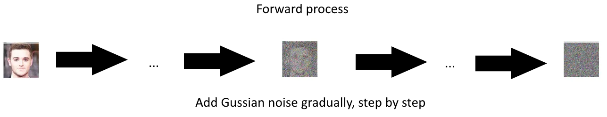

Figure a, the forward process of common diffusion model adapted from Ho
et al (2020)

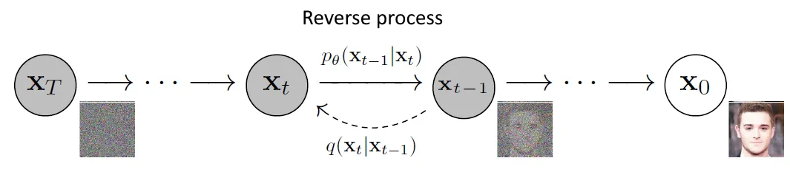

Figure b, the reverse process of common diffusion model adapted from Ho
et al (2020)

In LDMs, generally speaking, the diffusion process is done on the latent
space instead of the pixel space, the image itself. And the semantic
meaning from user inputs such as text and images is also added into the
reverse process in the form of semantic feedback generated by the
transformers according to the inputs.

In LDMs, the input image x first pass through an encoder to become a
latent vector, then the latent vector goes through the forward process
to add noise gradually to become a noisy latent vector and really goes
through the reverse process. Before that, the inputs from the user such
as text prompts, original images, etc. will first process through the
transformer to process and compress to get the intermediate
representation which represents the semantic meaning of the user input.
Then such intermediate representation is then mapped to the intermediate
layers of UNet which are used as the first denoise network on the noisy
latent vector, and it is also mapped to the second denoising autoencoder
that turns the noisy latent vector back into the "clean" latent vector.
The mapping of the intermediate representation is done by the
cross-attention mechanism, such that the user input can guide the
denoise network to generate latent vector respect to image that required
by user. Then the noisy latent vector first pass through the modified
U-Net and the later modified autoencoder to become the "clean" latent
vector. This latent vector is then passed through a decoder to turn back
into an image as generated image. Below shows the overall architecture
of LDMs.

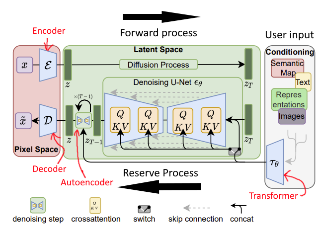

Figure c shows the overall architecture of LDMs. Adapted from Rombach et
al. (2022)

To train the model, two losses needed to be calculated to optimize the
model, perceptual loss and diffusion loss. The perceptual loss is the
loss from the encoder and decoder when they project the visual image
into the latent space as a latent vector by the encoder, and reconstruct
the image from the latent vector back to the visual image by the
decoder. The loss function is *L1* or *L2* loss,
by using such a loss function, a good training result can ensure the
reconstructed image is not blurry and accurate. Another loss is
Diffusion loss representing the loss from the diffusion process.
According to the paper, the Diffusion loss (*LLDM*) is:

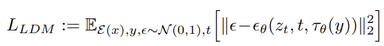

This loss function is adapted from the diffusion loss function for
common diffusion model (*LDM*):

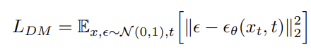

In *LLDM*, the input image *x* has replaced with *ε(x)* which
is the latent vector. And it replaced the *xt* to
*zt* which is the latent state of the U-Net at time t.
(*LLDM*) also added the condition *y* into the formula which
are the user inputs like prompt, image input, etc. And the
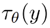 is the mentioned transformer
output on condition *y*. Furthermore, the *t* is the time step of the
denoising autoencoders from time step *t*=1, …, *T* , as the diffusion
part of the model remove noise from a normally distributed variable
gradually, which is the same as a reverse Markov Chain at length *T*.
*∈θ* in the equation represent this.

In the trained model, to generate an image the reverse process is
applied. In the beginning, a random noise image is generated by a random
seed and converted to the latent space, and the user input is converted
by the transform as an intermediate representation and applied to the
two denoise networks as mentioned by the attention mechanism. Then the
noise image passes through the U-Net then autoencoder denoise network to
give the result latent vector, which will then be converted to the
generated image by the final decoder.

Below is a 512x512 image example generate by my laptop with RTX3060
laptop GPU with using Stable Diffusion web UI (AUTOMATIC1111, 2023) and
the trained stable diffusion model v1.4 released by stability AI. The
prompt is “A pig that fly on the sky.” with 25 iteration with Eular a
sampler:

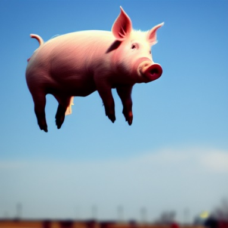

Figure d, generated image with prompt “A pig flying on the sky.”

We can see the generated image is reflecting exactly what we want, and
the image is very realistic.

# Problems with Latent Diffusion Models and attempts to improve it: Concept control with Textual Inversion or/and LoRA

The LDMs application like the trained model of stable diffusion is
robust to generate a variety of images according to user demands
specifically according to user text prompts. But unfortunately, what if
the text user described a new object that is not exist in the training
dataset or the concept is too complex that is hard to describe by text?
The model will not be able to generate what the user described. To solve
this problem a technique called Textual inversion can be used.
Generally, Texture inversion works by introducing a/multiple new word(s)
(called pseudo-word(s) in the paper) to the model with what to generate
according to this word. So that once that new word(s) like "mycatA" is
present in the prompt, the model will able to generate the exact image
that contains the semantic meaning of "mycatA". One of the
state-of-the-art approaches to do Textual Inversion is proposed by Gal
et al. (2022). In their approach, only a few images provided as examples
to the model on what exactly the new wording(s) is/are is already enough
to train the model to generate the respective image. In their method,
firstly the new word(s) will be converted into tokens and then converted
to the word embedding, which is the vector representation of the
word(s). Then the word embedding will be passed to the text transformer
mentioned in the above section and fused into the
 , which is the mentioned
transformer output on condition y, which is used to guide the denoise
network to generate user-wanted images. Then they compare the generated
image with the desired image (the provided sample) to optimize the
embedding vector only until an image that meets what the new word(s)
described is created. Below image shows the outline of Textual Inversion
process (Gal et al., 2022):

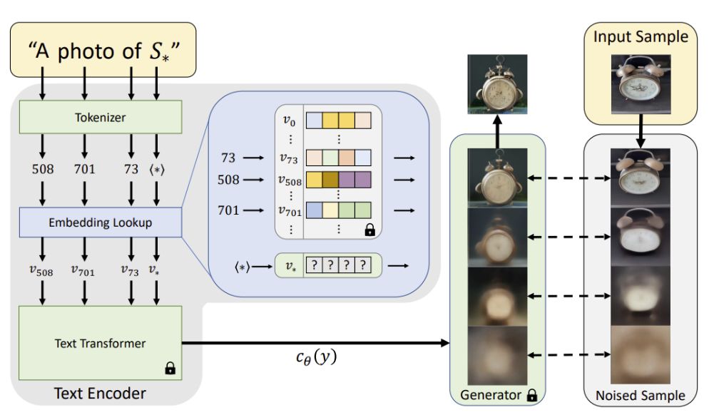

Figure e, overall working principle of Textual inversion, adapted from
Gal et al. (2022)

In the above figure, notice that the Transformer that used to generate
, as well as the generator
(the denoise network with the final decoder) is locked when training
Textual inversion. This means that the trained LDMs model itself has no
change when training the Textual Inversion. And the trained embedding
vector with respect to the new word(s) can be saved separately for
future use without affecting anything on the main model. This can
prevent the main model performance affected by the low number of data
samples when training Textual Inversion. Furthermore, this means the
trained texture inversion embedding can be used as a plugin to add to
the image generation main model when needed. In fact, the trained
texture inversion embedding is very small, usually less than 1MB in
size, which means it consumes neglectable memory when using it and is
easy to distribute. This is especially true when compared to the main
model which are usually few GB in size. Not at all, as each trained
textual inversion is independent of the others, multiple trained textual
inversion embeddings can be used together to generate images that have
multiple special concepts.

Below shows a successful texture inversion example from the paper from
Gal et al. (2022):

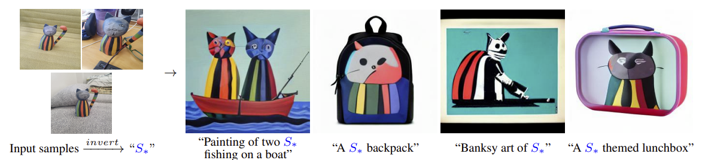

Figure f, Example of Textual Inversion, obtain from Gal et al. (2022).

We can see the model is now capable to generate the user specified cat
in the sample images when the prompt includes the new word
*S\**. Furthermore, Textual Inversion is also capable to link
new word(s) to a specific style of image, like generate image with a
specific artist's style.

Another method of adding new concepts to the model is using Low-Rank
Adaptation (LORA) on the LDMs. The LoRA is originally introduced by Hu
et al. (2021) for Large Language Model (LLM) to make the model adapt to
the new task at minimal additional parameters. In the work carried out
by Smith et al. (2023), they try to adapt the LoRA mechanism into the
stable diffusion which indeed uses LDMs, and call it C-LoRA. In their
method, they update the cross attention inside the U-Net and add a new
LoRA weight deltas that respect to the new concept into the key-value
(K-V) inside cross attention. Below is some of their result when using
C-LORA when compared to textual inversion:

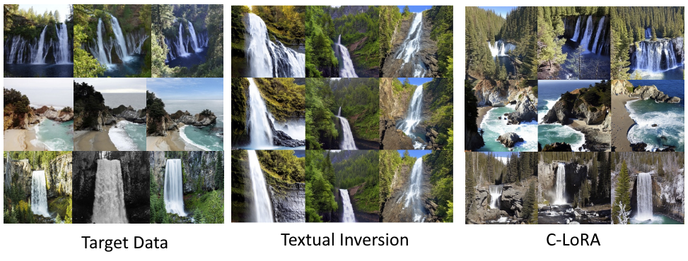

Figure g, the left is the target data, middle is result by textual
inversion, left is by C-LoRA, all image adapted from Smith et al. (2023)

From the above, we can see that both Textual Inversion and C-LoRA can
allow the LDMs to learn new concepts by providing a few examples to the
model to train with C-LoRA/Textual Inversion. However, the variation
type in the content inside the generated image by using Textual
Inversion is significantly less than that of C-LoRA. This means LoRA
will be more suitable for users that want to create images with more
variation, not fixed to the same pose/landscape like Textual Inversion.

The LoRA exists as the additional weight deltas so that no weight update
in the original model is needed at training. This means trained LoRA can
be acted as a separate plugin to the model, and apply it only when
needed. Furthermore, as LoRA weights are additive to the cross
attention, multiple trained LoRA can be used together to generate images
with multiple new concepts like that in Textual Inversion. However, in
my experience, the file sizes of trained LoRA is significantly larger
than that of Textual Inversion. Usually, the LoRA file need 30 to 300
MB, when compared to 1MB\> on Textual Inversion.

# Problems with Latent Diffusion Models and attempts to improve it: Detailed image control

Other than using Textual Inversion to add a new concept to the model,
what about controlling how the object inside the generated image exists?
At the simple ways to generate images by using text only, it will be
hard to do so, since it will be hard to describe exactly how the image
should be to the model to allow it to generate actually. Textual
inversion can still do this by training new word embedding with
additional images for that "type" of condition or train a new LoRA for
that condition, but there can be a variety of conditions required by the
user on the generated image, it is not so feasible for the user to train
each condition one by one. In the original LDMs paper, one way to
address this problem is to use image to image generation.

By using image-to-image generation, the user can specify which part of
the image should generate what by specifying the input image, such as
adding color blocks on the image like doing image segmentation. With
some related text prompts, the model is very capable to generate a
specific image by adding such an image. The principle of how this work
is simple, the condition  output from the transformer
now becomes both image input and text prompt to guide the generation
network. Below is an example tested by me with the setup mentioned
before with model anything v4.0 (Andite, 2023), 50 sampling step, 7 CFG
scale, 0.65 denoising strength:

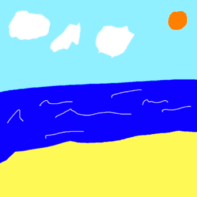

Figure h, image to image example to specific condition, left is the
input image, and right is the generated image.

From the above figure I use the prompt “A sunny beach, cloud at sky, sun
at the right corner of the sky, thick oil paint, canvas texture.” with
the left image, we can see the model can distinguish what color block
inside the input image is and draw the respective content out. Notice
that if I use only the prompt “sun at right corner” without image input,
the sun does still appear at the right corner, but can be not in this
exact “right corner” position with random size, it will be so hard to
tell the model exactly where the sun is at and how big it should be by
using the word only. But with the assistance of an input image, the
model will understand where exactly the “right corner” is and put the
sun there with the size according to the input image.

A neural network structure called ControlNet which uses a similar
concept to guide the network is proposed by Zhang & Agrawala (2023).
When using ControlNet with LDMs, other than using the color block to
guide the model to generate the image, ControlNet also allows users to
use image edges such as those from Canny, Hough edge detector, etc.,
user sketch, HED Edge, using posture models such as Openpose to set
human pose, segmentation map, and depth map to generate the specifically
wanted scene. For simplicity, below shows some of the practical examples
of using COCO-Stuff (Caesar et al., 2018) semantic segmentation map,
Canny edge, and Openpose to generate specific wanted images from their
paper:

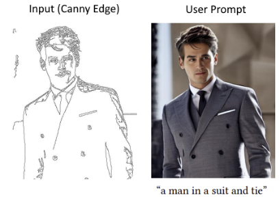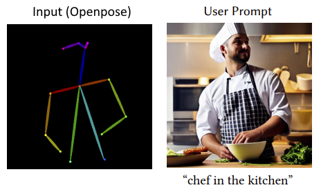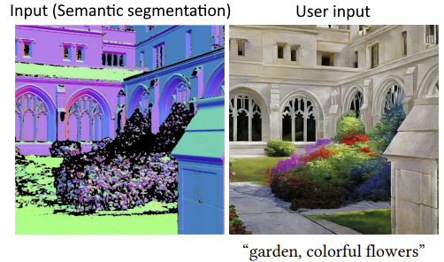

Figure i, Image generated with ControlNet applied, left is using canny
edge, middle is Openpose, and right is Semantic segmentation with
COCO-Stuff, all result adapted from (Zhang & Agrawala, 2023)

From the above, we can see that ControlNet works pretty well to guide
image generation according to what users want. Also, as ControlNet is a
trained additional neural network that can accept inputs for different
conditions, even if the conditions has only slightly different from each
other, users do not have to retrain every time for a different condition
i.e., different poses that are required on Textual Inversion/LoRA.

The ControlNet works as an additional network to guide the LDMs
according to the additional conditions. It first does a zero convolution
on the additional condition then passes the result added with the input
(initial noise latent vector) by feature addition into the ControlNet as
inputs, then the inputs pass through the same structure of the U-Net of
LDMs at the encoder part (inside ControlNet) as well as the middle
block. But after passing through the middle block, the result will do
zero convolution 1 time then apply to the middle block inside U-Net
through feature addition, and then the mentioned result do zero
convolution multiple times according to which block of the Decoder
inside U-Net it has to apply with through feature addition, the low the
block the more zero convolution is needed. By adding the feature after
zero convolution to the respective block of decoders inside U-Net, the
ControlNet can guide the LDMs to generate the wanted image. Below is an
illustration from their paper on how ControlNet works
generally: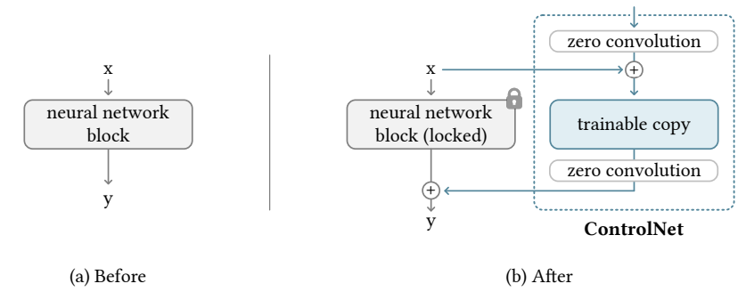

Figure j, how ControlNet works, adapted from (Zhang & Agrawala, 2023)

As the weights of the original LDMs is locked during training, like
Textual Inversion and LoRA, ControlNet can be also use as a plugin.

I tried the ControlNet (model from the author available on Hugging Face
[Here](https://huggingface.co/lllyasviel/ControlNet)) with Web UI
mentioned on the Openpose Varian only. It does work on some poses like
those shown on paper, however, I am not able to generate images on some
poses, see below as an example.

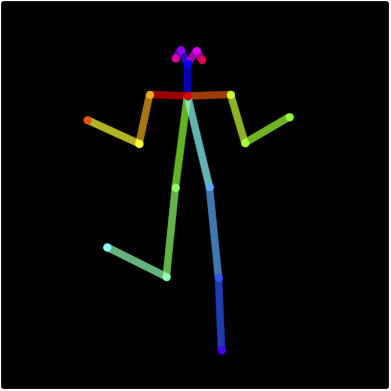

Figure k, left is the Openpose model input, left is the generated image
with prompt “A girl” with model: Anything—V4.0

From above we can see the hands of the girl follow the pose I had set,
however, the left legs did not follow that at all. This indicate the
model is not perfect, works still had to be done to improve it.

Furthermore, in the above picture, the girl's hand looks fine at first
glance. But when you look closer, the hand is poorly drawn, the finger
is just compressed together, which is not possible in real life for a
normal person. This is a common problem when using LDMs to draw human
hands. Because hands are nuanced with a lot of details with a lot of
conditions, like a hand can appear inside the training image with 0 (a
fist filmed at the back) to 5 fingers (an opened hand), to the model,
they are learned as hands. When the user uses the prompt that has "hand"
to generate an image, the model will draw out a hand that "mix" all hand
variant it learned, which cause such a poorly drawn hand.

In the paper, Zhang & Agrawala (2023) mentioned another variant of
ControlNet that use the OpenPifPaf pose model (Kreiss et al., 2021)
which includes the hand model (Openpose does not have it). And they
demonstrated that inside paper it can map a correct hand to the
generated images.

Like LoRA, the ControlNet model is significantly bigger than a trained
Textual Inversion. In my observation, the Openpose ControlNet model has
~700MB in size, this increases the memory usage when running the model,
as the ControlNet model is needed to move to memory when using the LDMs
to generate images.

# LDMs is slow, what to do?

One of the problems of LDMs is the speed of generating images is slow.
Although switching to diffuse the image itself to diffuse the latent
space of the image which reduced iteration time significantly, the speed
of generation is still significantly slower than the GAN model. This is
because the LDMs and DMs themselves need to care out multiple iterations
to denoise the image gradually, while the GAN needs 1 pass to generate
an image. In comparison, an image that uses 1 second to generate at GAN
will take serval seconds to generate by LDMs (Li et al., 2023).

To address this problem, there is an attempt to carry out 4-bit
post-training quantization (PTQ) on the weight inside the trained model
(Li et al., 2023). This should be able to reduce computational resource
consumption, mainly memory, and increase computational speed. In the
research paper, they call their customized quantization method
Q-Diffusion, and they both tested on LDMs and DMs. In their works, they
reduce the trained model that uses full precision on their weights to 4
bits without significant degradation of the image quality, which is not
possible to achieve in traditional quantization. As in the traditional
quantization method, the calibration process to calibrate the
performance of the quantized model back only consider one time step of
the model, but LDMs have many. Thus, their calibration process also
considers multiple time steps of the model that come from fixed
intervals across all time steps. Although their reported Frechlet
Inception Distance (FID) score shows that the 4-bit model quantized by
their method had an increase of ~63%, from 2.98 to 4.86 when compared to
the full-precision model, their quantized model still has comparable
results with the full precision model judged by the image itself, for
example, see below figure:

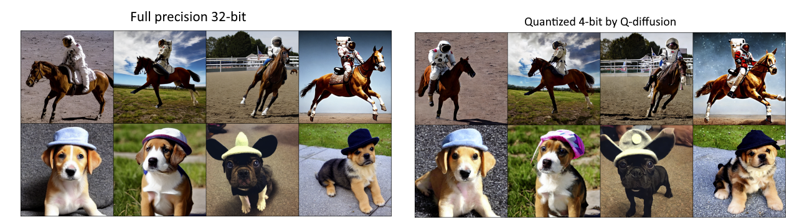

Figure l, full precision model vs quantized 4-bit model, adapted from

We can see the quality of the image between the 4-bit quantized model is
similar to full precision 32-bit. The difference is mainly the semantic
meaning of the image such as the background and capture angle
difference, etc.

However, in this paper they mentioned the memory and computational cost
reduction effect will be evaluated in their future work, thus they did
not give any information about them. But it will be very easy to
estimate the result, especially on the memory consumption. In their
study, they reduce the model weight from 32-bit to 4-bit, thus the
memory will be approximately 4/32 = 12.5% of the original model. And
according to a similar work but on Convolutional neural networks (CNN),
their speed increased from average of 2.9 times from a 32-bit model to a
quantized 4-bit (Trusov et al., 2021). If the speed on quantized 4-bit
LDMs is similar to the above case when compared to the original 32-bit
model, it will be comparable to the faster model like GAN mentioned
without a significant quality drop in terms of image quality in
practical use.

# Conclusion and future works

The LDMs is a robust image generation model that can create many types
of images. Even if the concept that the user wants to create is not
known or hard to understand by the model, the user can also introduce
the new concept to the model by train and applying LoRA and/or Textual
Inversion. If the user needs precise control of the image generation,
they can use image-to-image generation and/or even apply ControlNet to
control how exactly the created image should be. However, they are not
perfect, such as Textual Inversion creates images with low variation,
which is against the advantages of a higher image generation variety of
LDMs when compared to GAN. Furthermore, the significantly large size of
LoRA and ControlNet when compared to Textual Inversion consumes more
memory when used. Not at all, the ControlNet looks to have high
versatility to different conditions, but in practice, it is not always
working.

In the future research can focus on how to improve the low image
variation on images generated by Textural Inversion, reducing the memory
size that is needed to run LoRA and ControlNet. Furthermore, future
research can also focus on how the ControlNet can work on different more
complex conditions, as well as how to improve it on the non-ideal case
like the case presented above. Lastly, on the running speed of the LDMs,
the actual memory usage as well as the computational speed on the
quantized 4-bit model is not yet measured and should be measured in the
future. Current study on LDMs carried out on 4-bit quantization, what
about 3-bit or even 2-bit? If it is possible and practical to quantize
the LDMs model to an even lower bit, the performance of running LDMs
should be even higher. Such further quantization can also be studied in
the future. Not at all, the quantization study can also carry out on the
C-LoRA and ControlNet mentioned in order to reduce the computational
cost such as memory usage and process time on them.

# References

andite. (2023). Andite/anything-v4.0 · hugging face. Hugging Face.
Retrieved April 29, 2023, from
https://huggingface.co/andite/anything-v4.0

AUTOMATIC1111. (2023). AUTOMATIC1111/stable-diffusion-webui: Stable
diffusion web UI. GitHub. Retrieved April 29, 2023, from
https://github.com/AUTOMATIC1111/stable-diffusion-webui

Caesar, H., Uijlings, J., & Ferrari, V. (2018). Coco-stuff: Thing and
stuff classes in context. In *Proceedings of the IEEE conference on
computer vision and pattern recognition* (pp. 1209-1218).

Croitoru, F. A., Hondru, V., Ionescu, R. T., & Shah, M. (2023).
Diffusion models in vision: A survey. *IEEE Transactions on Pattern
Analysis and Machine Intelligence*.

Kreiss, S., Bertoni, L., & Alahi, A. (2021). Openpifpaf: Composite
fields for semantic keypoint detection and spatio-temporal
association. *IEEE Transactions on Intelligent Transportation
Systems*, *23*(8), 13498-13511.

Gal, R., Alaluf, Y., Atzmon, Y., Patashnik, O., Bermano, A. H., Chechik,
G., & Cohen-Or, D. (2022). An image is worth one word: Personalizing
text-to-image generation using Textual Inversion. *arXiv preprint
arXiv:2208.01618*.

Cao, Z., Hidalgo, G., Simon, T., Wei, S.-E., &amp; Sheikh, Y. (2021).
OpenPose: Realtime multi-person 2D pose estimation using part affinity
fields. *IEEE Transactions on Pattern Analysis and Machine
Intelligence*, 43(1), 172–186.
https://doi.org/10.1109/tpami.2019.2929257

Ho, J., Jain, A., & Abbeel, P. (2020). Denoising diffusion probabilistic
models. *Advances in Neural Information Processing Systems*, *33*,
6840-6851.

Hu, E. J., Shen, Y., Wallis, P., Allen-Zhu, Z., Li, Y., Wang, S., ... &
Chen, W. (2021). Lora: Low-rank adaptation of large language
models. *arXiv preprint arXiv:2106.09685*.

Mansimov, E., Parisotto, E., Ba, J. L., & Salakhutdinov, R. (2015). Generating images from captions with attention. *arXiv preprint arXiv:1511.02793*.

Kingma, D. P., & Welling, M. (2013). Auto-encoding variational
bayes. *arXiv preprint arXiv:1312.6114*.

Li, X., Lian, L., Liu, Y., Yang, H., Dong, Z., Kang, D., ... & Keutzer,
K. (2023). Q-Diffusion: Quantizing Diffusion Models. *arXiv preprint
arXiv:2302.04304*.

Reed, S., Akata, Z., Yan, X., Logeswaran, L., Schiele, B., & Lee, H.
(2016, June). Generative adversarial text to image synthesis.
In *International conference on machine learning* (pp. 1060-1069). PMLR.

Rombach, R., Blattmann, A., Lorenz, D., Esser, P., & Ommer, B. (2022).
High-resolution image synthesis with latent diffusion models.
In *Proceedings of the IEEE/CVF Conference on Computer Vision and
Pattern Recognition* (pp. 10684-10695).

Stability AI (2022). Stability AI. Retrieved April 28, 2023, from
https://stability.ai/

Siddiqui, J. R. (2022). *What are stable diffusion models and why are
they a step forward for image generation?* Medium. Retrieved April 29,
2023, from
https://towardsdatascience.com/what-are-stable-diffusion-models-and-why-are-they-a-step-forward-for-image-generation-aa1182801d46

Smith, J. S., Hsu, Y. C., Zhang, L., Hua, T., Kira, Z., Shen, Y., & Jin,
H. (2023). Continual Diffusion: Continual Customization of Text-to-Image
Diffusion with C-LoRA. *arXiv preprint arXiv:2304.06027*.

Sohl-Dickstein, J., Weiss, E., Maheswaranathan, N., & Ganguli, S. (2015,
June). Deep unsupervised learning using nonequilibrium thermodynamics.
In *International Conference on Machine Learning* (pp. 2256-2265). PMLR.

Trusov, A., Limonova, E., Slugin, D., Nikolaev, D., & Arlazarov, V. V.
(2021, January). Fast implementation of 4-bit convolutional neural
networks for mobile devices. In *2020 25th International Conference on
Pattern Recognition (ICPR)* (pp. 9897-9903). IEEE.

Zhang, L., & Agrawala, M. (2023). Adding conditional control to
text-to-image diffusion models. *arXiv preprint arXiv:2302.05543*.
